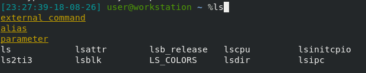
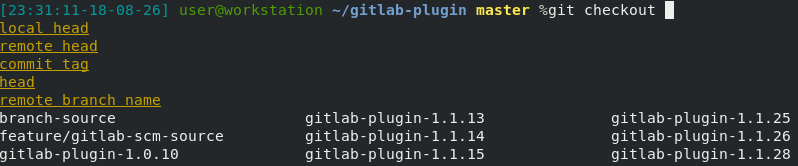

# ZSH-preset lde
> Zsh preset, usable for dev, ops and devops

## Overview

This prompt is designed to fit to most sysadmin and developpers 

## Motivations

Today a lot of presets exists on differents prompts.
An example of theses presets is [oh my zsh](https://ohmyz.sh/).

MyMotivation is to provide a rich functionnal shell using only native functions of zsh to keep a simple, fast and light shell.

## FEATURES

- Local completion (files dand directory)
- Remote completion (over ssh)
- Smart completion (filter directory and files commands)
- Command Args completion with descriptions
- Vcs support (enable support of [git](https://git-scm.com/), [subversion](https://subversion.apache.org/), [mercurial](https://www.mercurial-scm.org/) and [bazaar](https://bazaar.canonical.com/)
- On vcs display branche of working copy and eventually current action (rebase,merge...)
- Display clock and date
- Prompt including user, hostname and return code of the last command
- Per user init shell script

### Per user init scripts
Each user on system where this configuration is installed can create a `.zsh` folder in his home directory to set env vars,init rbenv pyenv or any other stuff. On each shell launch files in this directory will be sourced

## Install
Copy folder `zshconfig` in this repository to your `/etc/zsh` folder

## License
GNU GPLv3
## TODO
Packaging

PR welcome

